# 🚀 Projeto Next.js

Projeto desenvolvido com foco em responsividade, performance e integração com vídeo.

---

## 📑 Índice

- [Instalação](#instalação)
- [Instalação de Dependências](#instalação-de-dependências)
- [Iniciando o Projeto](#iniciando-o-projeto)
- [Tecnologias Usadas](#tecnologias-usadas)
- [Imagens de Design](#imagens-de-design)
- [Contribuições](#contribuições)
- [Licença](#licença)

---

## 🧰 Instalação

Siga os passos abaixo para rodar o projeto localmente.

### 1. Clone o repositório

```bash
git clone https://github.com/antonio-luis-marques/challenge-front-end.git
cd challenge-front-end
```

---

## 📦 Instalação de Dependências

Após clonar o repositório, instale as dependências com:

```bash
yarn install
# ou
npm install
```

---

## ▶️ Iniciando o Projeto

Para rodar o servidor de desenvolvimento:

```bash
yarn dev
# ou
npm run dev
```

O projeto estará disponível em: [http://localhost:3000](http://localhost:3000)

---

## ⚙️ Tecnologias Usadas

Este projeto foi desenvolvido com as seguintes tecnologias:

| Tecnologia        | Descrição                                                                 |
|-------------------|---------------------------------------------------------------------------|
| **Next.js**        | Framework React para SSR e geração estática.                             |
| **React**          | Biblioteca JavaScript para construção de interfaces.                     |
| **TypeScript**     | Superset do JavaScript com tipagem estática.                             |
| **Tailwind CSS**   | Estilização com classes utilitárias.                                     |
| **Material UI**    | Componentes visuais com design limpo e responsivo.                       |
| **Axios**          | Cliente HTTP para requisições a APIs.                                    |
| **Zod**            | Biblioteca de validação de esquemas com integração ao TypeScript.        |
| **next-video**     | Componente para streaming de vídeos no Next.js.                          |

---

## 🖼️ Imagens de Design

### 💻 Versão Desktop

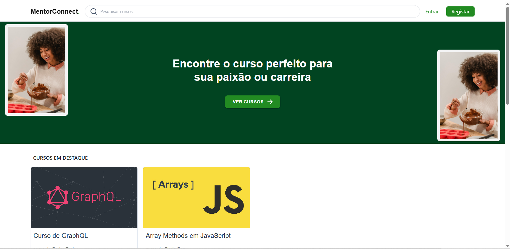
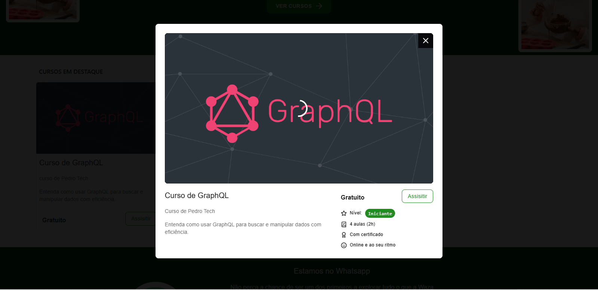
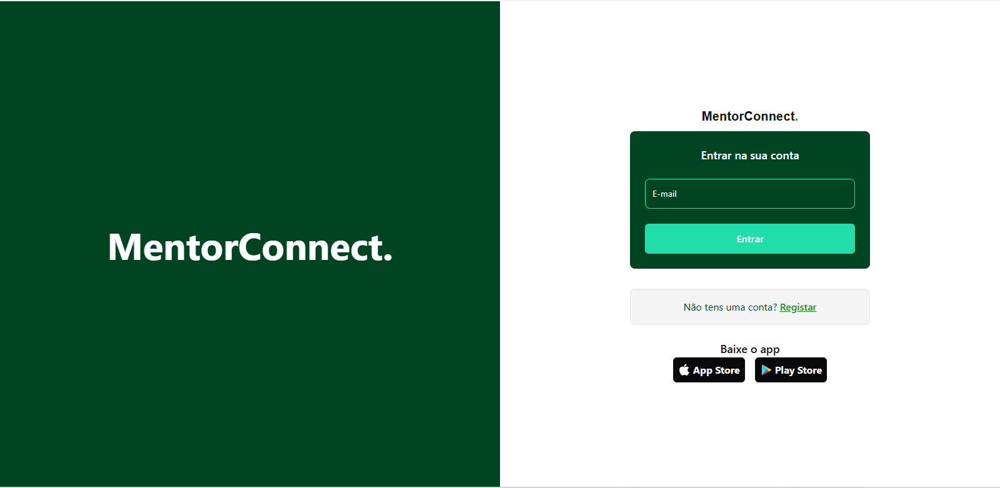
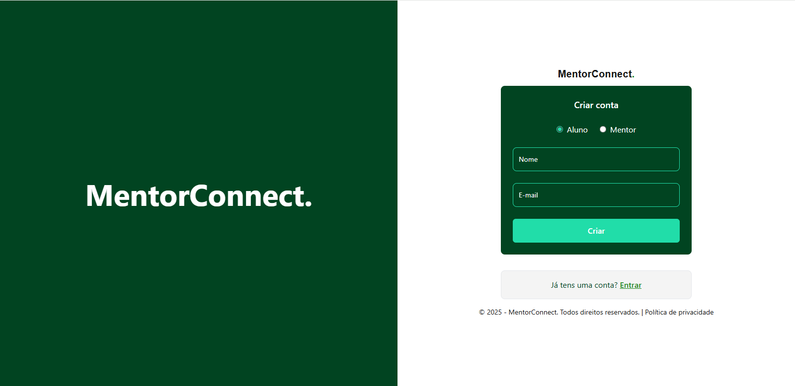
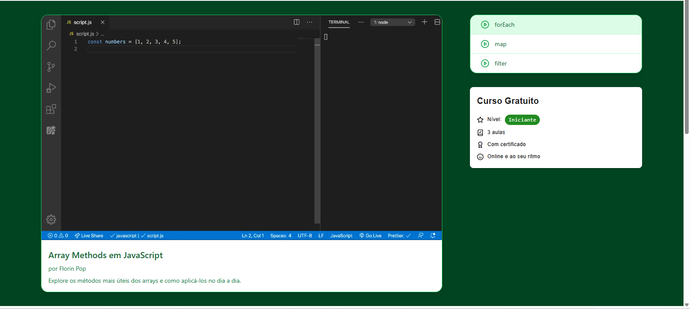

---

### 📱 Versão Mobile

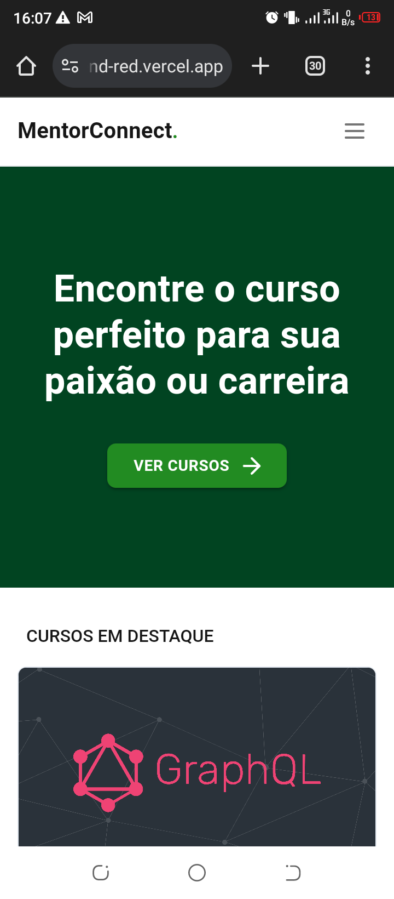
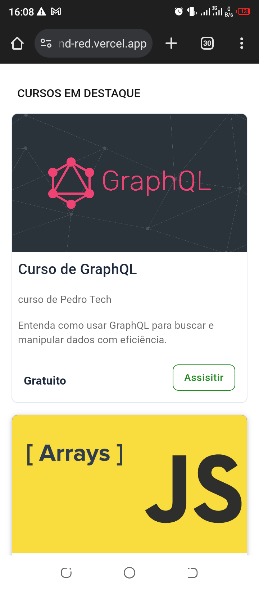
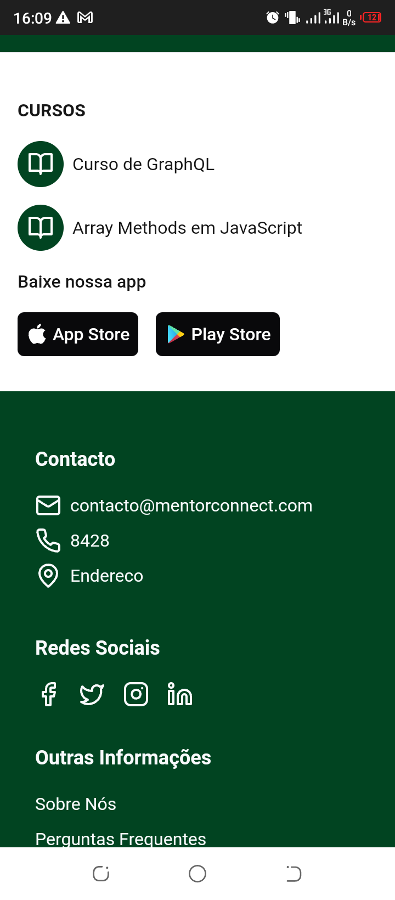
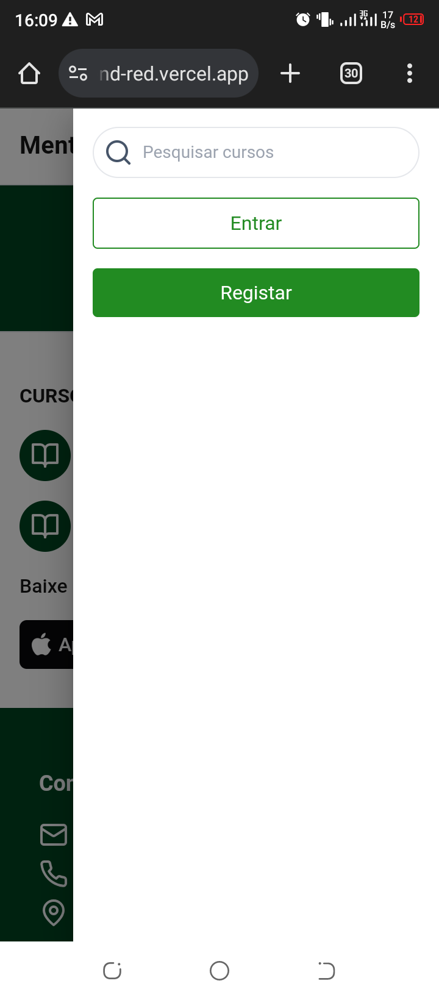
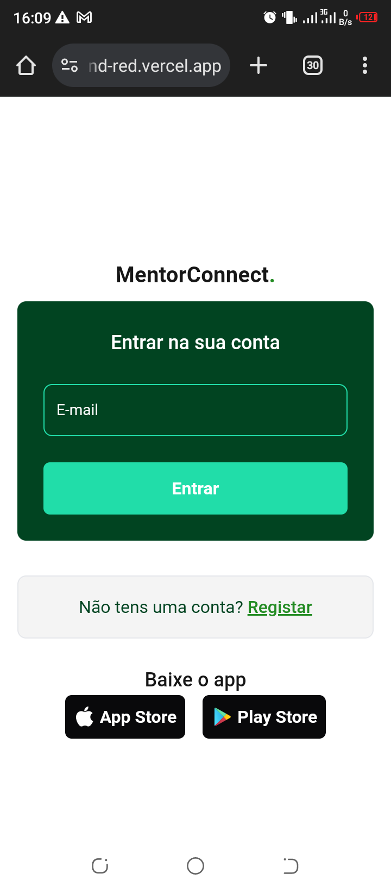
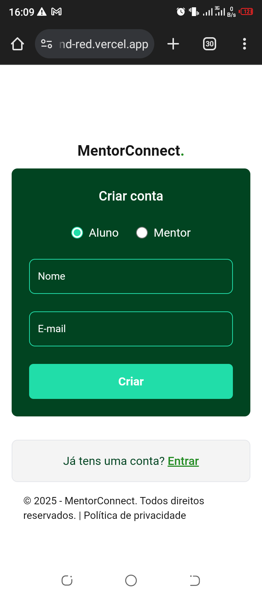
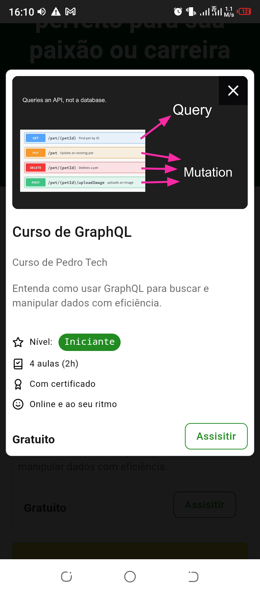


---

## 🤝 Contribuições

Contribuições são bem-vindas!  
Abra uma issue com sugestões, melhorias ou relatando bugs.  
Pull requests também são muito bem-vindos!.

---

## 📄 Licença

Este projeto está licenciado sob a [MIT License](LICENSE).
